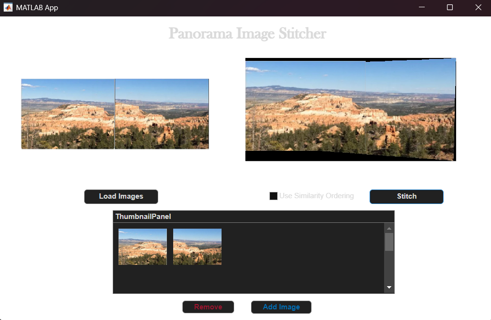
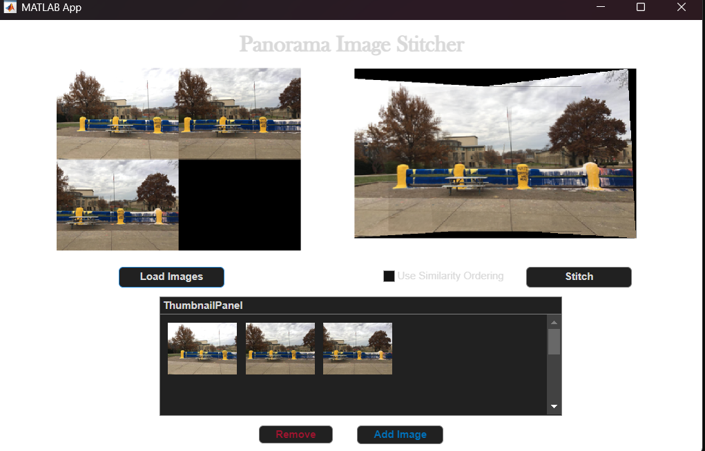
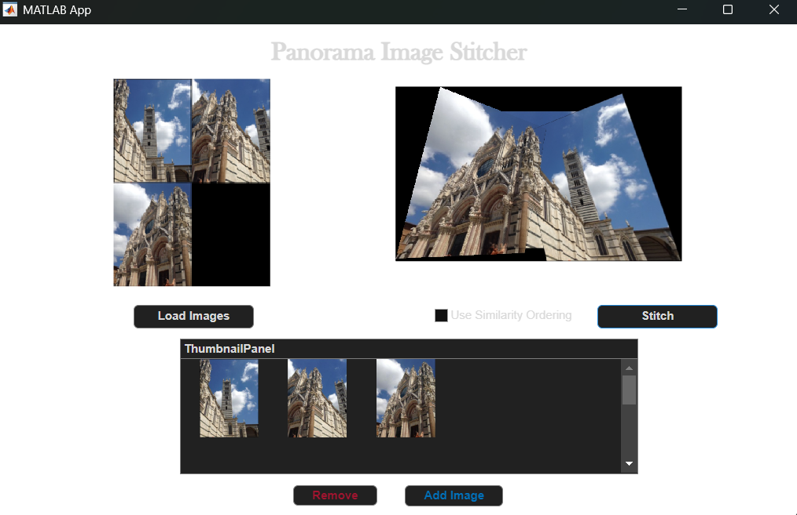
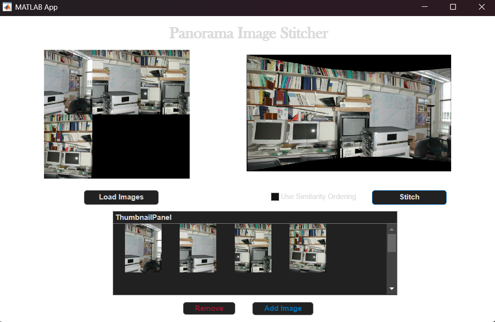

# Panorama Image Stitcher

 

A MATLAB app that stitches multiple overlapping photos into a single panorama, using SURF feature matching and projective homography estimation — built entirely on MATLAB's Computer Vision Toolbox, with no external dependencies required.

## Approach

1. Pick the middle image (by index) as a fixed anchor.
2. For each remaining image, detect SURF keypoints, match features against the current stitched result, and estimate a projective transform with `estimateGeometricTransform2D`.
3. Warp both the current result and the new image into a shared reference frame sized to fit both.
4. Blend the overlap region with a flat 50/50 alpha average; non-overlapping regions are copied directly from whichever image covers them.
5. Repeat until every image has been merged into the growing panorama.

An optional **similarity ordering** mode is also included: before stitching, it estimates a sensible processing order by counting SURF feature matches between every pair of images and greedily chaining together the most similar neighbors.

## App Interface

- Load any number of images via file picker, with live thumbnails
- Click a thumbnail to select and remove a specific image
- Optional similarity-ordering checkbox
- One-click stitching with visual loading state
- Side-by-side view of source montage and final stitched output

## Sample Results

**1.jpeg + 2.jpeg:**



**desk1.jpeg – desk4.jpeg:**

<table>
<tr>
<td></td>
<td></td>
</tr>
</table>

**fence1–3.jpeg + scene1–2.jpeg:**



## Project Structure

```
PanoramaStitching/
├─ README.md
├─ PanoramaStitchingFinal_exported.m
├─ sample_images/
│  ├─ 1.jpeg, 2.jpeg, 3.jpeg
│  ├─ desk1.jpeg – desk4.jpeg
│  ├─ fence1.jpeg – fence3.jpeg
│  └─ scene1.jpeg, scene2.jpeg
└─ results/
   ├─ result2.png
   ├─ result3.png
   ├─ result3-high.png
   └─ result4-desk.png
```

## Setup & Dependencies

- MATLAB (R2021a or later recommended)
- Computer Vision Toolbox — provides `detectSURFFeatures`, `extractFeatures`, `matchFeatures`, `estimateGeometricTransform2D`
- Image Processing Toolbox

No external libraries required — everything runs on MATLAB's built-in toolboxes.

## Usage

1. Open `PanoramaStitchingFinal_exported.m` in MATLAB (or its App Designer `.mlapp` source, if available).
2. Click **Load Images** and select a set of overlapping photos.
3. (Optional) Enable **Use Similarity Ordering** to auto-sequence the images.
4. Click **Stitch**.

## Known Limitations

- Overlap blending is a flat 50/50 alpha average, not distance-weighted feathering, so visible seams can appear in high-contrast overlaps.
- Every image is aligned against a single fixed anchor rather than progressively refined against the growing panorama, which can accumulate distortion with many images.
- No cylindrical/spherical projection, so wide panoramas show perspective stretching toward the edges.

## Possible Extensions

- Cylindrical projection prior to warping, to reduce edge distortion on wide panoramas
- True distance-weighted feather blending across seams
- Exposure/color compensation between source images
- Progressive re-anchoring or global bundle adjustment across all images
